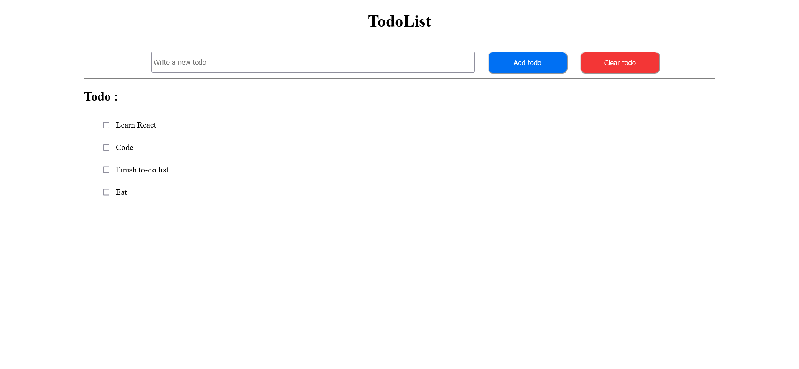
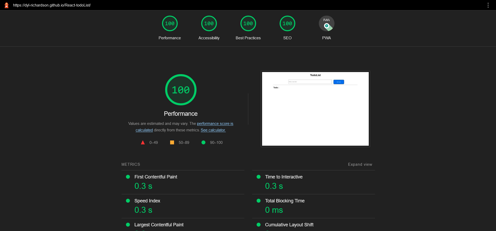

## Description

Introduction to React : creation of a to-do list 

## Task :

- be able to create a new React application
- be able to "think in React"
- be able to use basic hooks for managing state and reactivity
- be able to organize your app in components

## Rendu :

## Perf :

